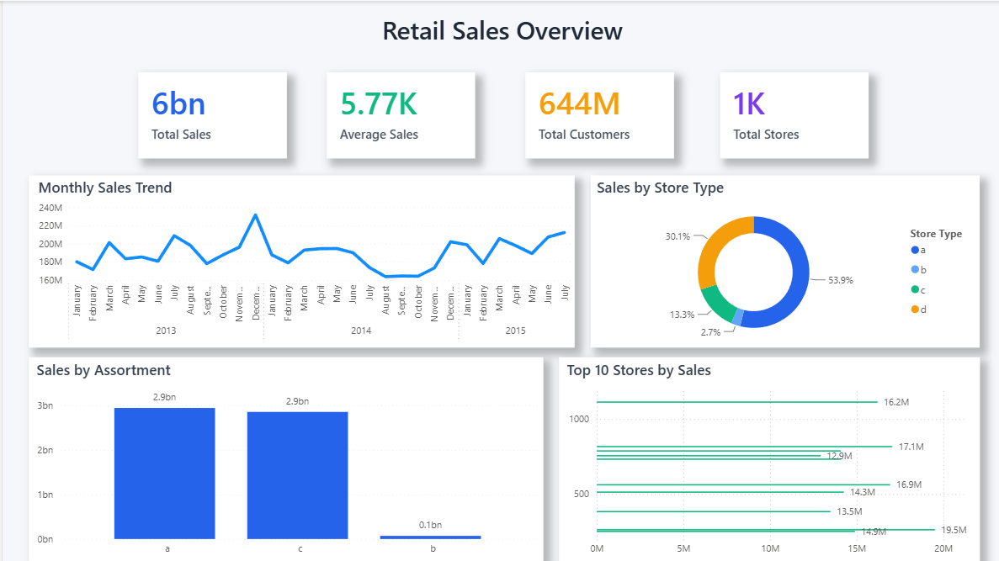
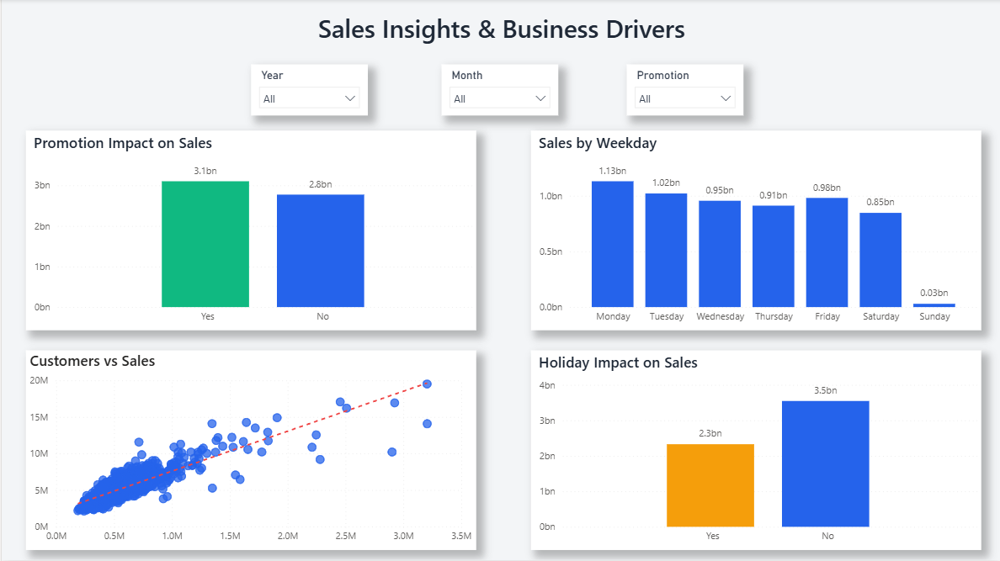

# Retail Sales Prediction & Business Performance Analytics

## Project Overview

This project focuses on predicting retail store sales using Machine Learning and delivering actionable business insights through an interactive Power BI dashboard.

The solution combines Data Science and Business Intelligence techniques to analyze historical sales data, build predictive models, and visualize business performance for better decision-making.

---

# Business Problem

Retail businesses generate massive amounts of sales data every day. Accurately forecasting future sales helps organizations:

- Improve inventory management
- Optimize staffing and operations
- Plan promotional campaigns
- Reduce stock shortages and overstocking
- Support data-driven business decisions

The objective of this project is to:

- Predict daily retail sales using Machine Learning.
- Identify key business drivers influencing sales.
- Compare multiple regression models.
- Visualize business performance using Power BI dashboards.

---

# Dataset

This project uses the **Rossmann Store Sales Dataset**.

### Files

- **train.csv** – Historical sales records
- **store.csv** – Store information

### Key Features

- Store ID
- Date
- Sales
- Customers
- Open
- Promo
- State Holiday
- School Holiday
- Store Type
- Assortment
- Competition Distance
- Competition Open Date
- Promo2 Information

### Target Variable

- **Sales**

---

# Project Workflow

## 1. Data Loading

- Loaded sales and store datasets
- Merged datasets
- Initial data inspection
- Missing value analysis

---

## 2. Data Preprocessing

- Missing value handling
- Data type conversion
- Duplicate checking
- Date formatting
- Outlier inspection

---

## 3. Exploratory Data Analysis (EDA)

Performed exploratory analysis to understand sales patterns and customer behavior.

### Analysis Included

- Sales distribution
- Customer distribution
- Sales trend over time
- Correlation analysis
- Store type comparison
- Promotion analysis
- Holiday analysis

---

## 4. Feature Engineering

Created additional features to improve model performance.

### Engineered Features

- Year
- Month
- Day
- Weekday
- Week of Year
- IsWeekend
- Competition Duration
- Promo Duration

---

## 5. Model Building

The dataset was split into training and testing sets.

Three regression models were developed and compared:

- Linear Regression
- Random Forest Regressor
- XGBoost Regressor

---

# Machine Learning Models

## Models Used

| Model | Purpose |
|--------|----------|
| Linear Regression | Baseline regression model |
| Random Forest Regressor | Captures non-linear relationships using ensemble learning |
| XGBoost Regressor | Gradient boosting model for improved prediction accuracy |

## Evaluation Metrics

The models were evaluated using:

- R² Score
- Mean Absolute Error (MAE)
- Root Mean Squared Error (RMSE)
- Mean Absolute Percentage Error (MAPE)

The best-performing model was selected based on overall predictive performance.

---

# Power BI Dashboard

## Page 1 — Retail Sales Overview

### KPIs

- Total Sales
- Average Sales
- Total Customers
- Total Stores

### Visualizations

- Monthly Sales Trend
- Sales by Store Type
- Sales by Assortment
- Top 10 Stores by Sales

### Dashboard Preview



---

## Page 2 — Sales Insights & Business Drivers

### Interactive Filters

- Year
- Month
- Promotion

### Visualizations

- Promotion Impact on Sales
- Sales by Weekday
- Customers vs Sales
- Holiday Impact on Sales

### Dashboard Preview



---

# Repository Structure

```text
Retail Sales Prediction & Business Performance Analytics
│
├── dashboards
│   ├── retail_sales_power_bi.pbix
│   ├── powerbi_page1.png
│   └── powerbi_page2.png
│
├── data
│   ├── train.csv
│   └── store.csv
│
├── notebooks
│   ├── 01_Data_Loading.ipynb
│   ├── 02_Exploratory_Data_Analysis.ipynb
│   ├── 03_Feature_Engineering.ipynb
│   ├── 04_Model_Building.ipynb
│   └── 05_PowerBI_Dataset.ipynb
│
├── .gitignore
├── README.md
├── requirements.txt
└── LICENSE
```

---

# Tools & Technologies

### Programming

- Python
- Pandas
- NumPy

### Machine Learning

- Scikit-learn
- XGBoost

### Data Visualization

- Matplotlib
- Seaborn

### Business Intelligence

- Power BI
- DAX
- Interactive Slicers
- KPI Cards

---

# Business Insights

The Power BI dashboard provides valuable insights into retail sales performance, including:

- Overall sales trends across different time periods.
- Comparison of sales across store types and assortments.
- Impact of promotional campaigns on sales.
- Holiday influence on business performance.
- Relationship between customer count and sales.
- Identification of top-performing stores.

---

# Business Impact

This solution helps retail businesses:

- Forecast future sales more accurately.
- Monitor store performance.
- Evaluate promotional effectiveness.
- Improve inventory planning.
- Support strategic business decisions using data.

---

# Future Improvements

- Deploy the model as a web application using Streamlit or Flask.
- Automate data pipeline and dashboard refresh.
- Experiment with advanced forecasting models such as LightGBM and CatBoost.
- Incorporate external factors like weather and economic indicators.

---

## Author

**Afnan Aslam**

Data Science | Machine Learning | Power BI
